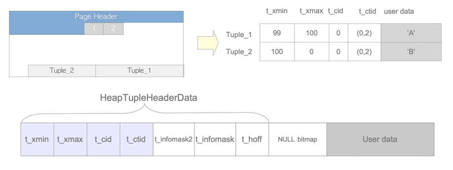

# Eş zamanlılık Kontrolü

* Çok kullanıcılı dblerin en temel özelliğidir. 
* Veritabanında birkaç işlem aynı anda çalıştığında, ACID'nin iki özelliği olan atomikliği ve yalıtımı koruyan bir mekanizmadır. (ACID)
* Eş zamanlı veriye en fazla sayıda erişimi sağlamak, lock miktarını azaltmak. 

Üç geniş eşzamanlılık kontrol tekniği vardır: 
* Çok Versiyonlu Eşzamanlılık Kontrolü (MVCC): pg kullanır.
* Katı İki Fazlı Kilitleme (S2PL)
* İyimser Eşzamanlılık Kontrolü (OCC) 
  
  
* Her tekniğin birçok varyasyonu vardır. 
* MVCC'de her yazma işlemi, eski sürümü korurken bir veri öğesinin yeni bir sürümünü oluşturur. 
* Bir işlem bir veri öğesini okuduğunda, sistem, bireysel işlemin yalıtımını sağlamak için sürümlerden birini seçer. 
* MVCC'nin ana avantajı, 'okuyucular yazarları engellemez ve yazarlar okuyucuları engellemez
* Bunun aksine, örneğin, S2PL tabanlı bir sistem, bir yazar bir kayıt yazarken, okuyucuları engellemelidir. 
* PostgreSQL ve bazı RDBMS'ler, Anlık Görüntü İzolasyonu (SI) adı verilen bir MVCC varyasyonu kullanır.
* PG ve bazı RDDBMS'ler MVCC'nin bir sürümü olan  Snapshot Isolation (SI) kullanırlar. 
* Oracle yöntemi: `rollback segment`: eski veri bu alana atılıp yenisi eskisinin üstüne yazılır. (mssql ve mysqlde de böyle)
* Bir satırın birden çok versiyonu saklanır. Bir gözlemci tek zamanda sadece bir sürümünü görebilir. Daha sonraki kayıt sürümleri daha güncel veriye sahiptir. 
* Her veritabanı oturumu için işlem izolasyonu sağlanarak, eşzamanlı işlemlerin aynı veri satırlarında gerçekleştirdiği güncellemelerin ürettiği tutarsız verilerin görüntülenmesi önlenmiş olur.
* * `visibility check` kurallarına bakarak uygun sürümü okur.
* PostgreSQL, DML için SSI (örneğin, SELECT, UPDATE, INSERT, DELETE) ve DDL için 2PL (Veri Tanımlama Dili, ör., CREATE TABLE vb.) kullanır.


## PG Yönteminin avantajları
* En katı işlem izolasyonu seviyesi olan Serializable Snapshot Isolation (SSI) seviyesinde bile bu garantiyi sağlar.
* Genel olarak tam işlem izolasyonu gerektirmeyen ve belirli çakışma noktalarının açıkça (explicitly) yönetilmesini tercih eden uygulamalar için PostgreSQL'de tablo ve satır seviyesi kilitleme imkanı da mevcuttur. 
* MVCC'nin doğru kullanımı genellikle kilitlerden daha iyi performans sağlayacaktır.
* Uygulama tanımlı tavsiye niteliğindeki kilitler (advisory lock), tek bir işleme bağlı olmayan kilitlerin alınması için bir mekanizma sağlar.

## İşlem İzolasyonu 

### Çeşitli izolasyon seviyelerinde yasaklanan olgular
- `Dirty Read`: (read uncommitted), sonuçlanmamış diğer işlem içindeki değişen veriyi okumak.
- `Non-Repeatable Reads`: Bir işlem daha önce okuduğu verileri yeniden okur ve verilerin başka bir işlem tarafından değiştirildiğini tespit eder (ilk okunmadan bu yana commit edilmiş).
- `Phantom Reads`: Bir vt işlemi, bir sorgu çalıştırır bir sonuç görür ama sonradan değiştiğini görür.


* Sequence'te sayı artırınca, işlem iptal edilse bile geri alınmaz. 

### Explicit Locking

* MVCC'nin istenen davranışı vermediği durumlarda uygulama kontrollü kilitleme için kullanılabilir. 
* Genel komutlar yürütülürken kullanılan tabloların uyumsuz bir şekilde silinmemesini (drop) veya değiştirilmemesini sağlamak için, uygun modlarda kilitler otomatik olarak oluşturulur. (TRUNCATE, INDEX)
* Mevcut kilitlerin listesini incelemek için pg_locks sistem görünümünü (view) kullanın.

#### Tablo seviyesinde kilitler

* Kilit modlarının isimleri tarihseldir. Bir dereceye kadar isimler, her bir kilitleme modunun tipik kullanımını yansıtır 
* İki işlem (transaction) aynı anda aynı tabloda çakışan modların kilitlerini tutamaz. 
* Çakışmayan kilit modları birçok işlem tarafından aynı anda gerçekleştirilebilir. Özellikle bazı kilit modlarının kendinden çakışmakta olduğuna (örneğin, bir ACCESS EXCLUSIVE kilidinin bir seferde birden fazla işlem tarafından gerçekleştirilemez)
* Bazı kilitler kendileriyle çakışmaz (örneğin, bir ACCESS SHARE kilidi birden çok işlem tarafından tutulabilir)


|   İzolasyon Seviyesi   |   Kirli Okuma      |   Tekrar Edilemeyen Okuma   |   Hayalet Okuma    |   Serileştirme Anomalisi   |
|--------------------------------------------|----------------------------------------|-------------------------------------------------|----------------------------------------|------------------------------------------------|
|  Read uncommitted                |  Mümkün (Fakat PG’de değil)  |  Mümkün                               |  Mümkün                      |  Mümkün                              |
|  Read committed                  |  Mümkün değil                |  Mümkün                               |  Mümkün                      |  Mümkün                              |
|  Repeatable read                 |  Mümkün değil                |  Mümkün değil                         |  Mümkün (Fakat PG’de değil)  |  Mümkün                              |
|  Serializable                    |  Mümkün değil                |  Mümkün değil                         |  Mümkün değil                |  Mümkün değil                        |


### Satır-seviyesi Kilitleri

Veri sorgulamayı etkilemez; sadece aynı satır için yazmaları ve kilitleri engeller.

**FOR UPDATE**
  - SELECT FOR UPDATE: 
  - SELECT ifadesi tarafından getirilen satırların güncelleme (update) için kilitlenmesini sağlar. 
  - Satırlar üzerinde UPDATE, DELETE, SELECT FOR UPDATE, SELECT FOR NO KEY UPDATE, SELECT FOR SHARE veya SELECT FOR KEY SHARE gerçekleştirmek isteyen diğer işlemler mevcut işlem sona erene kadar engellenir. 
  - DELETE, where koşullu UPDATE ile

**FOR NO KEY UPDATE**
  - Daha zayıf
  - **SELECT FOR KEY SHARE**'i engellemez.

**FOR SHARE**
  - Diğer işlemlerin (transaction) bu satırlarda UPDATE, DELETE, SELECT FOR UPDATE veya SELECT FOR NO KEY UPDATE yapmasını bloklar
  - SELECT FOR SHARE veya SELECT FOR KEY SHARE gerçekleştirmesini bloklamaz.

**FOR KEY SHARE**
  - SELECT FOR UPDATE engellenir. DELETE veya anahtar değerlerini değiştiren herhangi bir UPDATE işlemini gerçekleştirmesini engeller.
  - SELECT FOR NO KEY UPDATE engellenmez. UPDATE’leri ve SELECT FOR NO KEY UPDATE, SELECT FOR SHARE veya SELECT FOR KEY SHARE’i engellemez.
  - 

### TransactionID

* `Transaction`: Veriyi bir kararlı halden diğer bir kararlı hale getirmek. (Banka hesabı)

Bir işlem başladığında, işlem yöneticisi tarafından işlem kimliği (txid) olarak adlandırılan benzersiz bir tanımlayıcı atanır. PostgreSQL'in txid'i 32-bit işaretsiz bir tamsayıdır, yaklaşık 4,2 milyar. Bir işlem başladıktan sonra yerleşik txid_current() işlevini çalıştırırsanız, işlev mevcut txid'i aşağıdaki gibi döndürür.


* Txids birbirleriyle karşılaştırılabilir. Örneğin, txid 100 bakış açısından, 100'den büyük olan txid'ler gelecektedir ve txid 100'den görünmezler; 100'den küçük txid'ler 'geçmişte' ve görünür. [Görsel](https://www.interdb.jp/pg/img/fig-5-01.png)
* Pratik sistemlerde txid uzayı yetersiz olduğu için PostgreSQL, txid uzayını bir daire olarak ele alır. Önceki 2,1 milyar txid 'geçmişte' ve sonraki 2,1 milyar txid 'gelecekte'.
* **wraparound problem**: https://www.interdb.jp/pg/pgsql05.html#_5.10.1.


```SQL
testdb=# BEGIN;
BEGIN
testdb=# SELECT txid_current();
 txid_current 
--------------
          100
(1 row)
```
## Kayıt (Tuple) Yapısı


[konu](https://www.interdb.jp/pg/pgsql05.html#_5.3.)

```sql
testdb=# CREATE EXTENSION pageinspect;
CREATE EXTENSION
testdb=# CREATE TABLE tbl (data text);
CREATE TABLE

```
## DML

### INSERT

```sql

testdb=# BEGIN;
INSERT INTO tbl VALUES('A');
INSERT 0 1
COMMIT;
testdb=# SELECT lp as tuple, t_xmin, t_xmax, t_field3 as t_cid, t_ctid 
                FROM heap_page_items(get_raw_page('tbl', 0));
 tuple | t_xmin | t_xmax | t_cid | t_ctid 
-------+--------+--------+-------+--------
    1 |    735 |      0 |     0 | (0,1)
(1 row)

```
* Tuple_1:

- `t_xmin`:  753. transaction
- `t_xmax`: 0, çünkü deleted or updated değil.
- `t_cid`: 0, çünkü bu kayıt txid 735in ilk kaydı, transactionda başka kayıtlar olsaydı 0,1 diye giderdi.
- `t_ctid`: (0,1), page0 istiyoruz zaten, tuple'da 1. 

### DELETE

```SQL
testdb=# BEGIN;
DELETE FROM tbl where data = 'A';
DELETE 1
COMMIT;
testdb=# SELECT lp as tuple, t_xmin, t_xmax, t_field3 as t_cid, t_ctid 
                FROM heap_page_items(get_raw_page('tbl', 0));
 tuple | t_xmin | t_xmax | t_cid | t_ctid 
-------+--------+--------+-------+--------
     1 |    735 |    736 |     0 | (0,1)
(1 row)

```
*********
`Dead Tuples`: 
* Silme ve güncellemede 
* Diskteki kayıt sırası bozulur (heap table). 
* index için de geçerli. 
* Bunların temizlenmesi gerekir. (AUTOVACUUM, VACUUM)

### UPDATE

2 tuple'da işlem yapılır. 
    - biri silme
    - biri ekleme
    - silinendeki t_xmax, eklenendeki t_xmin olur. 

```sql
postgres=# SELECT lp as tuple, t_xmin, t_xmax, t_field3 as t_cid, t_ctid 
                FROM heap_page_items(get_raw_page('tbl', 0));
 tuple | t_xmin | t_xmax | t_cid | t_ctid 
-------+--------+--------+-------+--------
     4 |    737 |    739 |     0 | (0,7)
     7 |    739 |      0 |     0 | (0,7)
(2 row)

```

## Gerekli Bakım İşlemleri


* Ölü kayıtları ve bunlara karşlık gelen indexlerdeki ölü kayıtları da çıkarma.
* `clog`taki gereksiz kısımları çıkarma: `pg_xact` dizininde transaction log dosyalarıyla.
* Eski txidleri dondurma: vacuum (autovacum) çalışır.
* FSM, VM ve istatistikleri güncelleme.

### Fill factor
Fillfactor, bir tablo (ve bir dizin için) için tanımlanabilen bir depolama parametresidir. PostgresSQL, yalnızca sayfa doluluk faktörü yüzdesinden daha azsa sayfaya yeni bir satır ekler. Kalan alan, güncellemeler sonucunda oluşturulan yeni satırlar için ayrılmıştır. Tablolar için varsayılan değer 100'dür, yani hiç yer ayrılmamıştır (ve dizinler için varsayılan değer 90'dır).

* Bir tablonun doldurma faktörü, 10 ile 100 arasında bir yüzdedir. 100 (tam paketleme) varsayılan değerdir. 
* Daha küçük bir doldurma faktörü belirtildiğinde, INSERT işlemleri tablo sayfalarını yalnızca belirtilen yüzdeye göre doldurur; her sayfada kalan alan, o sayfadaki satırları güncellemek için ayrılmıştır. 
* Bu, UPDATE'e bir satırın güncellenmiş kopyasını orijinaliyle aynı sayfaya yerleştirme şansı verir; bu, farklı bir sayfaya yerleştirmekten daha etkilidir.
* Hiçbir zaman güncellenmeyen bir tablo için **tam paketleme** en iyi seçimdir
* Yoğun güncellenen alan tablolarda daha küçük doldurma faktörleri uygundur.
* TOAST tabloları için ayarlanamaz.

#### İyi-kötü tarafı

**Sık Yapılan Ekleme/Güncelleme İşlemleri**: `FILLFACTOR`'ı düşürmek, sık sık ekleme ve güncelleme işlemlerinin yapıldığı ortamlarda faydalıdır, çünkü bu sayede sayfa bölünmelerinin olasılığı azaltılır.

**Parçalanma Dengesi**: `FILLFACTOR`'ı düşürmek, yazma ağırlıklı iş yükleri için performansı artırabilir, ancak aynı zamanda toplam sayfa sayısını da artırarak verilerin daha fazla parçalanmasına ve potansiyel olarak daha yavaş okuma performansına yol açabilir. Doğru dengeyi bulmak önemlidir.

```sql
-- Create a sample table
CREATE TABLE example_table (
    id SERIAL PRIMARY KEY,
    data TEXT
);

-- Insert some sample data
INSERT INTO example_table (data)
SELECT md5(random()::text)
FROM generate_series(1, 1000);

-- Alter the table to set FILLFACTOR to 70
ALTER TABLE example_table SET (FILLFACTOR = 70);

-- Create an index with FILLFACTOR set to 70
CREATE INDEX example_index ON example_table (data) WITH (FILLFACTOR = 70);

-- Check FILLFACTOR for the table
SELECT relname, reloptions
FROM pg_class
WHERE relname = 'example_table';

-- Check FILLFACTOR for the index
SELECT indexname, indexdef
FROM pg_indexes
WHERE tablename = 'example_table';


```


### Kaynaklar
* https://pgdash.io/blog/postgres-transactions.html - Videolu anlatım
* https://qr.ae/TWnqjY
* http://shiroyasha.io/transaction-isolation-levels-in-postgresql.html
* https://tapoueh.org/blog/2018/07/postgresql-concurrency-isolation-and-locking/
* https://www.cybertec-postgresql.com/en/transactions-in-postgresql-read-committed-vs-repeatable-read/
* https://postgrespro.com/blog/pgsql/5967910
* https://www.cybertec-postgresql.com/en/what-is-fillfactor-and-how-does-it-affect-postgresql-performance/
