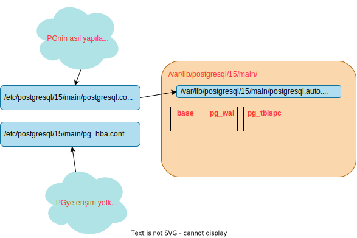

# Kurulum

Eğer kişisel bilgisayarımızda bir sanal makina oluşturarak postgres kurulumu yapmak istiyorsak en kısa yol vagrant iledir. [Vagrant kurulumu](../vagrant.md) 
## Gereksinimler

```
gpgyi okumak için
apt update && apt install -y gnupg2

# ekrana basan dil mesajı için

locale-gen tr_TR.UTF-8
localedef -i tr_TR -f UTF-8 tr_TR.UTF-8


CREATE DATABASE mydatabase
    WITH OWNER = your_username
         ENCODING = 'UTF8'
         LC_COLLATE = 'tr_TR.UTF-8'
         LC_CTYPE = 'tr_TR.UTF-8'
         TEMPLATE = template0;

```

## Postgres Kurulumu
pg sürüm 15 için ve debian 11 için
https://www.postgresql.org/download/linux/debian/ adresine gidin

Eğer cluster'ı başlatırken özel ayarlar yapmak istiyorsanız buraya başvurun.
[Özel initdb ayarları](ozel_ayarlar.md)
Yoksa aşağıdaki gibi devam edin.

Debian sistemlerde pg kümesi otomatik varsayılan dizinlerde oluşturulur. 

'psql' komut satırından çalışan ve sunucu kurulumuyla birlikte gelen gelişmiş bir istemcidir. psql'in parametrelerini görmek için

```
psql --help
 ```
[psql tanıtımı](https://tubitak-bilgem-yte.github.io/pg-yonetici/mydoc_postgresql_istemcileri_psql.html)
[psql periodic table](https://www.reddit.com/media?url=https%3A%2F%2Fexternal-preview.redd.it%2FWouP-ObT2rA0hrikf25-ebcxL7QpJ8qqIbYwO4n42Fc.png%3Fwidth%3D1080%26crop%3Dsmart%26auto%3Dwebp%26s%3Def739bed33fcbbe432cf3f36fa3accb7fa3b8e4b)


### Cluster
Postgres çalışan servisi ve onun veri dizini birlikte `cluster` denmektedir.
Postgres servisinin paket yerleri, dağıtıma göre değişir. Bir makine üzerine tercih edilmemekle birlikte birden çok cluster kurulabilir.
* Tek servis ve port
* Tek veri dizini
* Tek ayar dosyası/dosya grubu
* Dağıtık cluster değildir.
* Veritabanı sunucusu'da denir.

### Debian Dağıtımları

```
Binaries: /usr/lib/postgresql/${version}/bin
Data: /var/lib/postgresql/${version}/${kume_adi}
```

**`Cluster` yönetimi**
* pg_ctl utility
* init.d scripts / systemd services
* pg_createcluster/pg_ctlcluster/pg_conftool vb.
 

### Redhat Dağıtımları

```

Binaries: /usr/pgsql-${version}/bin
Data: /var/lib/pgsql/${version}/data

```

### **`Cluster` yönetimi**
* pg_ctl utility
* init.d scripts / systemd services


### Ayarlar nerede yapılır?



Postgresql ayar dosyaları: En Önemli 2 ayar dosyası var.
*  [postgresql.conf](postgresql.conf.md) [*](https://postgresqlco.nf/en/doc/param/)
varsayılan yeri ```/var/lib/postgresql/${version}/${cluster_adı}```. Cluster'ın çalışması gereken tüm ayarları içerir. İçinde bir çok parametre vardır. postgresql.conf a alternatif olarak postgresql.auto.conf dosyası da özel ayarların yazılması için kullanılabilir.
* [pg_hba.conf](pg_hba.conf.md) İstemci erişimi denetimi bu dosyayla sağlanır.

* ------ diğer ayarlar
* replication: postgresql.conf içinde. 
* initdbde bazı parametreler var. 
* her bir objede set edilen/edilebilen. (fillfactor)
* geliştirici parametreleri
* compile-time parametreleri
* [Ayarlara Genel Bakış](ozel_ayarlar.md)


## postgresql servisinin yönetimi
```
# postgres yöntemi
pg_ctl -D /var/lib/postgresql/${version}/${küme_adı}/ ${action}

# systemd yöntemi
systemctl ${action} postgresql.service

```


### Kaynaklar
* [Detay](https://tubitak-bilgem-yte.github.io/pg-yonetici/mydoc_postgresql_kurulum_ayarlanmasi.html)
* [GSSAPI Kurulumu](https://blog.crunchydata.com/blog/windows-active-directory-postgresql-gssapi-kerberos-authentication)
* [SSL Yapılandırması](https://www.cybertec-postgresql.com/en/setting-up-ssl-authentication-for-postgresql/)
